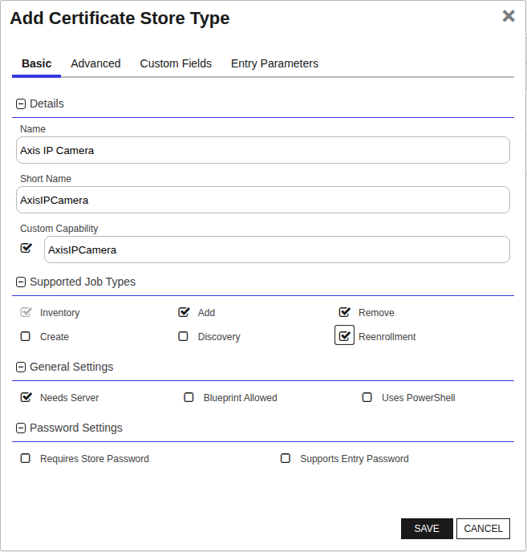
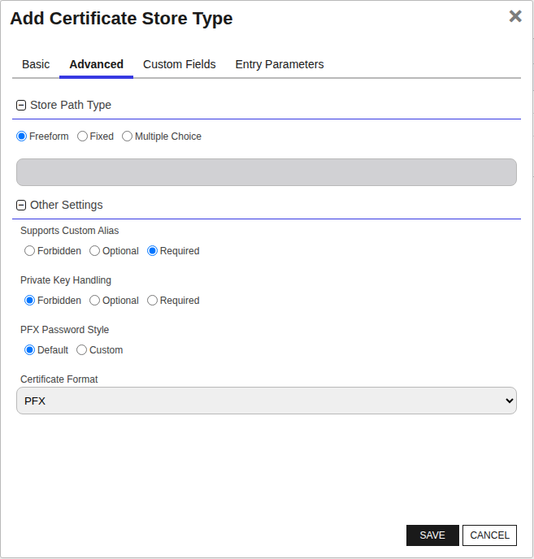
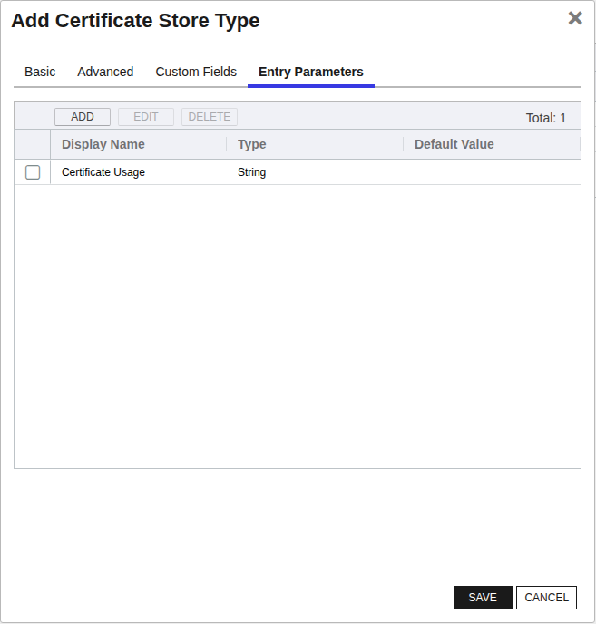

<h1 align="center" style="border-bottom: none">
    AXIS IP Camera Universal Orchestrator Extension
</h1>

<p align="center">
  <!-- Badges -->

<a href="https://github.com/Keyfactor/axis-ipcamera-orchestrator/releases"></a>


</p>

<p align="center">
  <!-- TOC -->
  <a href="#support">
    <b>Support</b>
  </a>
  ·
  <a href="#installation">
    <b>Installation</b>
  </a>
  ·
  <a href="#license">
    <b>License</b>
  </a>
  ·
  <a href="https://github.com/orgs/Keyfactor/repositories?q=orchestrator">
    <b>Related Integrations</b>
  </a>
</p>

## Overview

The AXIS IP Camera Orchestrator extension remotely manages certificates on AXIS IP Network Cameras. This
orchestrator extension inventories certificates on the camera's certificate store, and it also supports adding new client-server certificates and adding/removing CA certificates.
New client-server certificates are created in the AXIS camera certificate store via On Device Key Generation (ODKG aka Reenrollment).
This means that certificates cannot be directly added to the AXIS camera, but instead the keypair is generated on the AXIS device and a certificate is issued for that keypair via a CSR submitted to Command for enrollment. 
This workflow is completely automated in the AXIS IP Camera Orchestrator extension. CA certificates can be added to the camera from uploaded CA certificates in Command.

### Use Cases

The AXIS IP Camera Orchestrator extension supports the following use cases:

1. Inventory of client-server & CA certificates 
2. Enrollment of client-server certificates with ability to bind the certificate for a specific usage*
3. Ability to remove CA certificates from the camera
4. Ability to add CA certificates to the camera

The Axis IP Camera Orchestrator extension DOES NOT support the following use cases:

1. Ability to remove client-server certificates from the camera
2. Ability to add client-server certificates to the camera

\* Currently supported certificate usages include: **HTTPS**, **IEEE802.X**, **MQTT**, **Other**


## Compatibility

This integration is compatible with Keyfactor Universal Orchestrator version 10.1 and later.

## Support
The AXIS IP Camera Universal Orchestrator extension is supported by Keyfactor. If you require support for any issues or have feature request, please open a support ticket by either contacting your Keyfactor representative or via the Keyfactor Support Portal at https://support.keyfactor.com.

> If you want to contribute bug fixes or additional enhancements, use the **[Pull requests](../../pulls)** tab.

## Requirements & Prerequisites

Before installing the AXIS IP Camera Universal Orchestrator extension, we recommend that you install [kfutil](https://github.com/Keyfactor/kfutil). Kfutil is a command-line tool that simplifies the process of creating store types, installing extensions, and instantiating certificate stores in Keyfactor Command.


1. Out of the box, an AXIS IP Network Camera will typically have configured an **Administrator** account. It is 
recommended to create a new account specifically for executing API calls. This account will need \'Administrator\' 
privileges since the orchestrator extension is capable of making configuration changes, such as installing and removing certificates.
2. Currently supports AXIS M2035-LE Bullet Camera, AXIS OS version 12.2.62. Has not been tested with any other firmware version.


## AxisIPCamera Certificate Store Type

To use the AXIS IP Camera Universal Orchestrator extension, you **must** create the AxisIPCamera Certificate Store Type. This only needs to happen _once_ per Keyfactor Command instance.


The AXIS IP Camera certificate store type represents a certificate store on an AXIS network camera
that maintains two separate collections of certificates:
* Client-server certificates (certs with private keys)
* CA certificates

It is expected that there be one (1) certificate store managed per AXIS network camera.


#### Axis IP Camera Requirements

1. User Account with \'Administrator\' privileges and password to access the camera
2. Camera serial number
3. Camera IP address (and likely port number)


#### Supported Operations

| Operation    | Is Supported                                                                                                           |
|--------------|------------------------------------------------------------------------------------------------------------------------|
| Add          | ✅ Checked        |
| Remove       | ✅ Checked     |
| Discovery    | 🔲 Unchecked  |
| Reenrollment | ✅ Checked |
| Create       | 🔲 Unchecked     |

#### Store Type Creation

##### Using kfutil:
`kfutil` is a custom CLI for the Keyfactor Command API and can be used to create certificate store types.
For more information on [kfutil](https://github.com/Keyfactor/kfutil) check out the [docs](https://github.com/Keyfactor/kfutil?tab=readme-ov-file#quickstart)
   <details><summary>Click to expand AxisIPCamera kfutil details</summary>

   ##### Using online definition from GitHub:
   This will reach out to GitHub and pull the latest store-type definition
   ```shell
   # Axis IP Camera
   kfutil store-types create AxisIPCamera
   ```

   ##### Offline creation using integration-manifest file:
   If required, it is possible to create store types from the [integration-manifest.json](./integration-manifest.json) included in this repo.
   You would first download the [integration-manifest.json](./integration-manifest.json) and then run the following command
   in your offline environment.
   ```shell
   kfutil store-types create --from-file integration-manifest.json
   ```
   </details>


#### Manual Creation
Below are instructions on how to create the AxisIPCamera store type manually in
the Keyfactor Command Portal
   <details><summary>Click to expand manual AxisIPCamera details</summary>

   Create a store type called `AxisIPCamera` with the attributes in the tables below:

   ##### Basic Tab
   | Attribute | Value | Description |
   | --------- | ----- | ----- |
   | Name | Axis IP Camera | Display name for the store type (may be customized) |
   | Short Name | AxisIPCamera | Short display name for the store type |
   | Capability | AxisIPCamera | Store type name orchestrator will register with. Check the box to allow entry of value |
   | Supports Add | ✅ Checked | Check the box. Indicates that the Store Type supports Management Add |
   | Supports Remove | ✅ Checked | Check the box. Indicates that the Store Type supports Management Remove |
   | Supports Discovery | 🔲 Unchecked |  Indicates that the Store Type supports Discovery |
   | Supports Reenrollment | ✅ Checked |  Indicates that the Store Type supports Reenrollment |
   | Supports Create | 🔲 Unchecked |  Indicates that the Store Type supports store creation |
   | Needs Server | ✅ Checked | Determines if a target server name is required when creating store |
   | Blueprint Allowed | 🔲 Unchecked | Determines if store type may be included in an Orchestrator blueprint |
   | Uses PowerShell | 🔲 Unchecked | Determines if underlying implementation is PowerShell |
   | Requires Store Password | 🔲 Unchecked | Enables users to optionally specify a store password when defining a Certificate Store. |
   | Supports Entry Password | 🔲 Unchecked | Determines if an individual entry within a store can have a password. |

   The Basic tab should look like this:

   

   ##### Advanced Tab
   | Attribute | Value | Description |
   | --------- | ----- | ----- |
   | Supports Custom Alias | Required | Determines if an individual entry within a store can have a custom Alias. |
   | Private Key Handling | Forbidden | This determines if Keyfactor can send the private key associated with a certificate to the store. Required because IIS certificates without private keys would be invalid. |
   | PFX Password Style | Default | 'Default' - PFX password is randomly generated, 'Custom' - PFX password may be specified when the enrollment job is created (Requires the Allow Custom Password application setting to be enabled.) |

   The Advanced tab should look like this:

   

   > For Keyfactor **Command versions 24.4 and later**, a Certificate Format dropdown is available with PFX and PEM options. Ensure that **PFX** is selected, as this determines the format of new and renewed certificates sent to the Orchestrator during a Management job. Currently, all Keyfactor-supported Orchestrator extensions support only PFX.

   ##### Custom Fields Tab
   Custom fields operate at the certificate store level and are used to control how the orchestrator connects to the remote target server containing the certificate store to be managed. The following custom fields should be added to the store type:

   | Name | Display Name | Description | Type | Default Value/Options | Required |
   | ---- | ------------ | ---- | --------------------- | -------- | ----------- |
   | ServerUsername | Server Username | Enter the username of the configured "service" user on the camera | Secret |  | ✅ Checked |
   | ServerPassword | Server Password | Enter the password of the configured "service" user on the camera | Secret |  | ✅ Checked |
   | ServerUseSsl | Use SSL | Select True or False depending on if SSL (HTTPS) should be used to communicate with the camera. This should always be "True" | Bool | true | ✅ Checked |

   The Custom Fields tab should look like this:

   

   ##### Entry Parameters Tab

   | Name | Display Name | Description | Type | Default Value | Entry has a private key | Adding an entry | Removing an entry | Reenrolling an entry |
   | ---- | ------------ | ---- | ------------- | ----------------------- | ---------------- | ----------------- | ------------------- | ----------- |
   | CertUsage | Certificate Usage | The Certificate Usage to assign to the cert after enrollment. Can be left 'Other' to be assigned later. | MultipleChoice |  | 🔲 Unchecked | ✅ Checked | 🔲 Unchecked | ✅ Checked |

   The Entry Parameters tab should look like this:

   

   </details>

## Installation

1. **Download the latest AXIS IP Camera Universal Orchestrator extension from GitHub.**

    Navigate to the [AXIS IP Camera Universal Orchestrator extension GitHub version page](https://github.com/Keyfactor/axis-ipcamera-orchestrator/releases/latest). Refer to the compatibility matrix below to determine whether the `net6.0` or `net8.0` asset should be downloaded. Then, click the corresponding asset to download the zip archive.

   | Universal Orchestrator Version | Latest .NET version installed on the Universal Orchestrator server | `rollForward` condition in `Orchestrator.runtimeconfig.json` | `axis-ipcamera-orchestrator` .NET version to download |
   | --------- | ----------- | ----------- | ----------- |
   | Older than `11.0.0` | | | `net6.0` |
   | Between `11.0.0` and `11.5.1` (inclusive) | `net6.0` | | `net6.0` |
   | Between `11.0.0` and `11.5.1` (inclusive) | `net8.0` | `Disable` | `net6.0` |
   | Between `11.0.0` and `11.5.1` (inclusive) | `net8.0` | `LatestMajor` | `net8.0` |
   | `11.6` _and_ newer | `net8.0` | | `net8.0` |

    Unzip the archive containing extension assemblies to a known location.

    > **Note** If you don't see an asset with a corresponding .NET version, you should always assume that it was compiled for `net6.0`.

2. **Locate the Universal Orchestrator extensions directory.**

    * **Default on Windows** - `C:\Program Files\Keyfactor\Keyfactor Orchestrator\extensions`
    * **Default on Linux** - `/opt/keyfactor/orchestrator/extensions`

3. **Create a new directory for the AXIS IP Camera Universal Orchestrator extension inside the extensions directory.**

    Create a new directory called `axis-ipcamera-orchestrator`.
    > The directory name does not need to match any names used elsewhere; it just has to be unique within the extensions directory.

4. **Copy the contents of the downloaded and unzipped assemblies from __step 2__ to the `axis-ipcamera-orchestrator` directory.**

5. **Restart the Universal Orchestrator service.**

    Refer to [Starting/Restarting the Universal Orchestrator service](https://software.keyfactor.com/Core-OnPrem/Current/Content/InstallingAgents/NetCoreOrchestrator/StarttheService.htm).


6. **(optional) PAM Integration**

    The AXIS IP Camera Universal Orchestrator extension is compatible with all supported Keyfactor PAM extensions to resolve PAM-eligible secrets. PAM extensions running on Universal Orchestrators enable secure retrieval of secrets from a connected PAM provider.

    To configure a PAM provider, [reference the Keyfactor Integration Catalog](https://keyfactor.github.io/integrations-catalog/content/pam) to select an extension and follow the associated instructions to install it on the Universal Orchestrator (remote).


> The above installation steps can be supplemented by the [official Command documentation](https://software.keyfactor.com/Core-OnPrem/Current/Content/InstallingAgents/NetCoreOrchestrator/CustomExtensions.htm?Highlight=extensions).


## Post Installation

The AXIS IP Camera Orchestrator Extension *always* connects to an AXIS IP Network Camera via HTTPS, regardless
of whether the \`Use SSL\` option on the certificate store is set to **false** (*The \`Use SSL\` option cannot be removed). This ensures the orchestrator
is connecting to a valid camera.

All network cameras come pre-loaded with one (1) or more device ID certificates, and one of these certificates is configured on the camera to be provided in the TLS handshake
to the client during an HTTPS request.

The orchestrator will not trust the device ID certificate, and will therefore deny the session to the camera.

To trust the device ID certificate, you must create a custom trust and add the root and intermediate CA certificates from the AXIS PKI chain to it.

### Steps to Create the Custom Trust:

1. Once the DLLs from GitHub are installed, create two (2) files in the sub-directory called "Files" with the below names (*Note: The "Files" folder should already exist):
   * **Axis.Root**
   * **Axis.Intermediate**

* **Default Path on Windows** - `C:\Program Files\Keyfactor\Keyfactor Orchestrator\extensions\[Axis IP Camera orchestrator extension folder]\Files`
* **Default Path on Linux** - `/opt/keyfactor/orchestrator/extensions/[Axis IP Camera orchestrator extension folder]/Files`
2. Copy and paste the PEM contents of the AXIS PKI root for the device ID cert configured for the HTTP server into the **Axis.Root** file
3. Copy and paste the PEM contents of the AXIS PKI intermediate for the device ID configured for the HTTP server into the **Axis.Intermediate** file

\* AXIS Device ID CA certificates can be found here: https://www.axis.com/support/public-key-infrastructure-repository

After the device ID is verified against the custom trust, the \`Store Path\` value of the certificate store will be compared against the SERIALNUMBER Subject DN attribute of the device ID certificate.
These values must match or the session will be denied.

> [!IMPORTANT]
> You will want to replace the device ID certificate bound to the HTTP server with a CA-signed certificate. To do this,
> you will need to schedule a Reenrollment job and select **HTTPS** as the Certificate Usage.

> [!IMPORTANT]
> After associating a CA-signed certificate with the HTTP server via the Reenrollment job, you need to make sure the orchestrator server trusts the HTTPS certificate.
> Therefore, you will need to install the full CA chain - including root and intermediate certificates - into the orchestrator server's local
> certificate store.


## Defining Certificate Stores


### Store Creation

#### Manually with the Command UI

<details><summary>Click to expand details</summary>

1. **Navigate to the _Certificate Stores_ page in Keyfactor Command.**

    Log into Keyfactor Command, toggle the _Locations_ dropdown, and click _Certificate Stores_.

2. **Add a Certificate Store.**

    Click the Add button to add a new Certificate Store. Use the table below to populate the **Attributes** in the **Add** form.

   | Attribute | Description                                             |
   | --------- |---------------------------------------------------------|
   | Category | Select "Axis IP Camera" or the customized certificate store name from the previous step. |
   | Container | Optional container to associate certificate store with. |
   | Client Machine | The IP address of the Camera. Sample is "192.167.231.174:44444". Include the port if necessary. |
   | Store Path | Enter the Serial Number of the camera e.g. `0b7c3d2f9e8a` |
   | Orchestrator | Select an approved orchestrator capable of managing `AxisIPCamera` certificates. Specifically, one with the `AxisIPCamera` capability. |
   | ServerUsername | Enter the username of the configured "service" user on the camera |
   | ServerPassword | Enter the password of the configured "service" user on the camera |
   | ServerUseSsl | Select True or False depending on if SSL (HTTPS) should be used to communicate with the camera. This should always be "True" |

</details>


#### Using kfutil CLI

<details><summary>Click to expand details</summary>

1. **Generate a CSV template for the AxisIPCamera certificate store**

    ```shell
    kfutil stores import generate-template --store-type-name AxisIPCamera --outpath AxisIPCamera.csv
    ```
2. **Populate the generated CSV file**

    Open the CSV file, and reference the table below to populate parameters for each **Attribute**.

   | Attribute | Description |
   | --------- | ----------- |
   | Category | Select "Axis IP Camera" or the customized certificate store name from the previous step. |
   | Container | Optional container to associate certificate store with. |
   | Client Machine | The IP address of the Camera. Sample is "192.167.231.174:44444". Include the port if necessary. |
   | Store Path | Enter the Serial Number of the camera e.g. `0b7c3d2f9e8a` |
   | Orchestrator | Select an approved orchestrator capable of managing `AxisIPCamera` certificates. Specifically, one with the `AxisIPCamera` capability. |
   | Properties.ServerUsername | Enter the username of the configured "service" user on the camera |
   | Properties.ServerPassword | Enter the password of the configured "service" user on the camera |
   | Properties.ServerUseSsl | Select True or False depending on if SSL (HTTPS) should be used to communicate with the camera. This should always be "True" |

3. **Import the CSV file to create the certificate stores**

    ```shell
    kfutil stores import csv --store-type-name AxisIPCamera --file AxisIPCamera.csv
    ```

</details>


#### PAM Provider Eligible Fields
<details><summary>Attributes eligible for retrieval by a PAM Provider on the Universal Orchestrator</summary>

If a PAM provider was installed _on the Universal Orchestrator_ in the [Installation](#Installation) section, the following parameters can be configured for retrieval _on the Universal Orchestrator_.

   | Attribute | Description |
   | --------- | ----------- |
   | ServerUsername | Enter the username of the configured "service" user on the camera |
   | ServerPassword | Enter the password of the configured "service" user on the camera |

Please refer to the **Universal Orchestrator (remote)** usage section ([PAM providers on the Keyfactor Integration Catalog](https://keyfactor.github.io/integrations-catalog/content/pam)) for your selected PAM provider for instructions on how to load attributes orchestrator-side.
> Any secret can be rendered by a PAM provider _installed on the Keyfactor Command server_. The above parameters are specific to attributes that can be fetched by an installed PAM provider running on the Universal Orchestrator server itself.

</details>


> The content in this section can be supplemented by the [official Command documentation](https://software.keyfactor.com/Core-OnPrem/Current/Content/ReferenceGuide/Certificate%20Stores.htm?Highlight=certificate%20store).


### Certificate Usage

Every certificate inventoried will have an Entry Parameter called \`Certificate Usage\`. 
There are five (5) possible options:

* **HTTPS**
* **IEEE802.X**
* **MQTT**
* **Trust**
* **Other**

1. HTTPS
   - This certificate usage describes the certificate bound to the camera's HTTP web server for HTTPS communication (i.e. server certificate or SSL/TLS certificate).
2. IEEE802.X
   - This certificate usage describes the client certificate to authenticate the camera to a server using EAP-TLS. This client certificate
   is presented to the 802.1x radius server for authentication.
3. MQTT
   - This certificate usage describes the client certificate used to authenticate the camera to the MQTT broker.
   In this scenario, the camera connects to the MQTT broker over SSL and performs a TLS handshake.
   The camera presents this client certificate to the MQTT broker.
4. Trust
   - This certificate usage describes a public certificate issued by a CA used to establish trust. 
5. Other
   - This certificate usage identifies all other certificates on the camera that do not fall under the pre-defined usages above.

> [!NOTE] 
> A Reenrollment (ODKG) job will not allow enrollment of certificates with **Trust** assigned as the \`Certificate Usage\`.
> Trust CA certificates can be added to the camera via a Management - Add job.

> [!NOTE]
> For a Reenrollment (ODKG) job, where the \`Certificate Usage\` assigned is **HTTPS**, IP and DNS are added as SANS
> to the enrolled certificate.
> 
> IP = Client Machine configured for the certificate store (excluding any port)
> 
> DNS = CN set in the Subject DN


## Caveats

> [!NOTE] 
> Reenrollment jobs will not replace or remove a client-server certificate with the same alias. They will also not remove 
> the original certificate if a particular \`Certificate Usage\` had an associated cert. Since the camera has limited storage,
> it will be up to the user to remove any unused client-server certificates via the AXIS Network Camera GUI.


## License

Apache License 2.0, see [LICENSE](LICENSE).

## Related Integrations

See all [Keyfactor Universal Orchestrator extensions](https://github.com/orgs/Keyfactor/repositories?q=orchestrator).